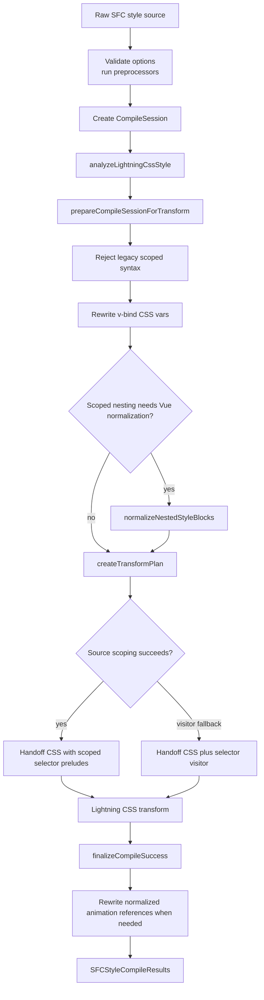

# Architecture

`@lightning-vue/compiler` replaces the PostCSS-backed style compilation path
from `@vue/compiler-sfc` with a Lightning CSS-backed implementation. The public
style compiler API stays compatible with the supported Vue SFC surface.

The runtime split is fixed: JavaScript handles Vue policy, and Lightning CSS
handles generic CSS work. JavaScript decides scope placement, source
preparation, and the few post-transform repairs Vue needs. Lightning CSS parses
CSS, lowers nesting, serializes output, normalizes animation syntax, and handles
CSS Modules.

## Why It Is Fast

The compiler is fast because Lightning CSS handles the generic CSS work.
JavaScript handles Vue policy: source analysis, scope placement, nested context,
and the small post-transform repairs Vue needs.

The common route follows four rules:

- Source analysis runs once, then `CompileState`, `sourceScopeMode`, and
  `TransformPlan` carry those facts through the session.
- Source rewrites encode Vue decisions before Lightning CSS runs when the
  rewrite can stay narrow.
- `TransformPlan.selectorsScopedInSource` tells
  `createLightningCssStyleVisitor` when selector callbacks can be skipped.
- Shared source scanning and light parsing live in `@lightning-vue/utils`, so
  hot paths avoid repeated full-source scans.

Lightning CSS selector visitors cross the Rust/JavaScript boundary for
selector-level work. Broad visitor use shows up as a slow path in headroom
benches. Visitor scoping is a fallback. Ordinary scoped selectors are rewritten
before the transform.

Regular expressions enter hot paths after measurement. Native regexp engines can
outperform handwritten JavaScript scans, and regexp code can be easier to audit.
Sophisticated matching is benchmarked against a small scanner before becoming a
routing dependency. Repeated full-source regexp passes have caused regressions
in this compiler.

## Measurement Model

The headroom benchmark separates native work from JavaScript work in the
compiler.

| Row                  | Measurement                                                        | Reading                                                 |
| -------------------- | ------------------------------------------------------------------ | ------------------------------------------------------- |
| authored CSS         | Lightning CSS transform on the original benchmark source           | raw transform baseline for the authored corpus          |
| handoff transform    | Lightning CSS transform on `TransformPlan.code`                    | native transform portion inside the full compiler route |
| forced selector hook | authored CSS transformed with an empty `Selector` visitor callback | selector-hook boundary cost for visitor-based routes    |
| full compiler        | validation, preparation, planning, transform, decode, finalization | actual package cost for the same corpus                 |

The primary headroom number is time-based:

```text
compiler JS overhead =
  (full compiler time - handoff transform time) / full compiler time
```

The handoff transform is faster or slower than authored CSS depending on the
source that preparation creates. Nested normalization, source scoping, and Vue
carrier expansion can change parse shape before Lightning CSS sees the input.

The PostCSS comparison benches show product-level speedup against Vue's current
style compiler path. `bench:headroom` points at the remaining JavaScript cost.

## Runtime Flow



[src/compileStyle.ts](./src/compileStyle.ts) and
[src/browser.ts](./src/browser.ts) define the runtime boundary. Both entrypoints
enter the shared compile-session pipeline in
[src/compileSession/](./src/compileSession/).

## Route Selection

The compiler is a route selector around Lightning CSS. Each route decides which
Vue work runs in JavaScript and which CSS work goes to the native transform.

| Input shape                                               | Route                                       | JavaScript work                                                 | Lightning CSS work                                  |
| --------------------------------------------------------- | ------------------------------------------- | --------------------------------------------------------------- | --------------------------------------------------- |
| Plain unscoped CSS                                        | direct transform                            | option validation and preprocessing                             | parse, lower, serialize                             |
| Scoped CSS with ordinary selectors                        | simple source scoping                       | inject `[data-v-xxx]` in selector preludes                      | parse, lower, serialize                             |
| Scoped local nested selectors                             | prepared local nested source                | normalize nested source and emit scoped local selector preludes | lower final CSS nesting, serialize                  |
| Scoped nested at-rule-only CSS                            | source scoping + Lightning nesting lowering | scope outer selector preludes                                   | lower nested at-rules, serialize                    |
| Scoped selectors with `:deep`, `:slotted`, or `:global`   | parsed source scoping with marker IR        | expand Vue carriers and place scope attributes                  | parse, lower, serialize                             |
| Source scoping failure or CSS Modules visitor requirement | Lightning selector visitor fallback         | run scoped selector policy through visitor callbacks            | parse, visitor traversal, lower, serialize          |
| Scoped local keyframes with animation declarations        | post-transform animation rewrite            | patch normalized animation references                           | keyframe renaming and animation shorthand normalize |

`sourceScopeMode` records the pre-transform selector scoping mode:

- `simple`: selector preludes can be scoped directly from source text.
- `parsed`: selector preludes need the scoped selector pipeline.
- `prepared-local`: nested normalization already emitted scoped local selector
  source.

`TransformPlan.selectorsScopedInSource` records the result of route selection.
When it is `true`, `createLightningCssStyleVisitor` returns no selector hook for
scoped rewriting.

## Phase Boundaries

| Phase                   | Owner          | State crossing the boundary                                                      |
| ----------------------- | -------------- | -------------------------------------------------------------------------------- |
| Session creation        | `session.ts`   | `CompileContext`, initial `CompileState`                                         |
| Source preparation      | `prepare.ts`   | rewritten `source`, `map`, `analysis`, `sourceScopeMode`                         |
| Transform planning      | `transform.ts` | `TransformPlan` with code, nesting flag, CSS Modules config, source-scoping flag |
| Lightning CSS transform | `transform.ts` | transformed code, source map, CSS Modules exports                                |
| Finalization            | `finalize.ts`  | scoped keyframe analysis, public `SFCStyleCompileResults`                        |

State values crossing phases:

- `analysis`: source facts collected before preparation
- `source`: current source after source-only preparation
- `sourceScopeMode`: selector scoping route selected for the current source
- `TransformPlan.code`: handoff CSS for Lightning CSS
- `TransformPlan.selectorsScopedInSource`: selector visitor scoping switch
- `analysis.keyframes`: local keyframe rename map used after Lightning CSS
  normalization

## Source Analysis And Utilities

[analysis.ts](./src/style/lightningcss/analysis.ts) gathers routing facts:

- nested selector children
- nested at-rule children
- selector descendants inside nested at-rules
- modern Vue scope carriers
- animation declarations
- local `@keyframes` names
- `v-bind(...)` usage

The structural source walk lives in `@lightning-vue/utils`. The same walk
collects nesting facts and local keyframe names, so compile-session routing can
reuse those facts later.

`@lightning-vue/utils` provides generic mechanics:

- source block scanning
- selector-prelude walking
- source-range helpers
- direct selector-prelude scoping
- selector parsing and stringifying helpers
- lightweight block-tree helpers for nested-source transforms

`@lightning-vue/compiler` applies Vue policy:

- `:deep(...)`, `:slotted(...)`, and `:global(...)` semantics
- scope injection rules
- nested context propagation
- prepared-local routing
- compatibility failures

Reusable lexing and simple parsing primitives live outside the compiler.
Vue-specific behavior lives in compile-session routing and scoped selector
modules.

## Nested Scoped CSS

Lightning CSS lowers CSS nesting quickly. Vue scoped styles add placement rules
for `[data-v-xxx]`. The compiler reshapes Vue-sensitive nested source before
Lightning CSS lowers it.

Nesting lowering serves the compiler algorithm, independent of target browser
support. `normalizeNestedStyleBlocks` can introduce compile-time structure such
as `:global(.foo)` context wrappers and `& { ... }` declaration wrappers.
Lightning CSS then resolves that prepared nested source into concrete selectors.
Preserving nested syntax in the output would either leak compile-time structure
or require a JavaScript implementation of the same selector-combination step.

Normalization runs for scoped nesting with Vue context:

- direct nested selector children
- Vue scope carriers whose context flows through nested at-rules

Plain local nested-at-rule-only cases skip normalization. They use source
selector scoping first, then Lightning CSS lowers the nested at-rules.

Authored CSS:

```css
.foo {
  color: red;
  .bar {
    color: blue;
  }
}
```

Normalized source shape:

```css
:global(.foo) {
  & {
    color: red;
  }
  .bar {
    color: blue;
  }
}
```

The outer `.foo` remains the nesting boundary. The original declarations move
into `& { ... }`, which compiles to:

```css
.foo[data-v-xxx] {
  color: red;
}
```

The nested `.bar` inherits `.foo` as context and receives the local scope:

```css
.foo .bar[data-v-xxx] {
  color: blue;
}
```

The nested pipeline has three modules:

| Module                                                                            | Responsibility                                        |
| --------------------------------------------------------------------------------- | ----------------------------------------------------- |
| [nesting/contextAnalysis.ts](./src/style/lightningcss/nesting/contextAnalysis.ts) | read selector context established by each nested rule |
| [nesting/instructions.ts](./src/style/lightningcss/nesting/instructions.ts)       | record block-local rewrite instructions               |
| [nesting/normalize.ts](./src/style/lightningcss/nesting/normalize.ts)             | apply those instructions as a source rewrite          |

The instruction phase decides whether declarations need an `& { ... }` wrapper,
which child blocks inherit context, and whether normalization can emit
`prepared-local` source. `prepared-local` means normalized nested selector
preludes already contain the local scope attribute; `createTransformPlan` can
pass that source to Lightning CSS without the generic source-scoping walk.

## Marker IR

Vue scope carriers need placement decisions that ordinary CSS selectors cannot
encode directly during source rewriting:

- `:global(...)` removes normal local scope injection from that branch
- `:deep(...)` freezes the local injection anchor
- `:slotted(...)` applies slot scope to its payload

The scoped selector pipeline represents those decisions with temporary selector
markers:

- `[__VUE_SCOPE_NO_INJECT__]`
- `[__VUE_SCOPE_DEEP__]`

Final CSS contains no temporary markers.

Marker IR improves performance by moving Vue carrier handling before the
Lightning CSS transform. `scopeLightningCssSource` parses each selector prelude,
expands carriers, places scope attributes, removes markers, and writes the
cleaned selector back into the source string. The handoff CSS contains ordinary
selectors, so `createLightningCssStyleVisitor` has no scoped selector work to
do.

The visitor path calls back into JavaScript while Lightning CSS traverses
selectors. Source rewriting pays the Vue-placement cost before the transform,
then hands Lightning CSS a selector tree that needs no selector callbacks.

The markers are selector attributes, so the existing selector parser,
stringifier, and source-rewrite utilities can carry them through `:is(...)`,
`:where(...)`, `:has(...)`, and nested selector containers. Placement reads
deep/no-inject state from the selector tree during the same pass. No side table
has to track carrier state for each branch.

For `:global(.btn)`, expansion produces a conceptual selector like:

```css
[__VUE_SCOPE_NO_INJECT__] .btn
```

The placement phase reads the marker and leaves `.btn` without local scope.

For `.panel :deep(.title)`, expansion produces a conceptual selector like:

```css
.panel [__VUE_SCOPE_DEEP__] .title
```

Placement scopes the local side before the deep boundary:

```css
.panel[data-v-xxx] .title
```

The scoped selector pipeline has three phases:

1. **Expansion** lowers `:deep(...)`, `:slotted(...)`, and `:global(...)` into
   selector states plus markers. Selector lists can fan out into multiple
   states.
2. **Placement** finds the local injection anchor and inserts `[data-v-xxx]` or
   `[data-v-xxx-s]`. Deep and no-inject markers control where anchor search
   stops.
3. **Cleanup** removes all temporary markers, including markers inside selector
   containers such as `:is(...)`, `:where(...)`, `:has(...)`, and `:not(...)`.

Marker IR limits JavaScript to Vue-specific placement. Lightning CSS still
handles parsing, nesting lowering, and serialization.

## Animation Rewrite

Animation/keyframe handling waits until after Lightning CSS. Lightning CSS
renames scoped local keyframes and normalizes animation shorthands. The compiler
records local keyframe names during source analysis. After Lightning CSS
produces normalized CSS, the compiler patches remaining animation references in
[scoped/animation/](./src/style/lightningcss/scoped/animation/).

The post-transform route has two stages:

- scan normalized CSS and produce explicit rewrite spans
- apply those spans to a string or `MagicString`

The custom JavaScript stays limited to local keyframe references that survive
Lightning CSS normalization.

## Public And Runtime Boundaries

The package replaces style compilation only:

- `compileStyle(...)`
- `compileStyleAsync(...)`
- `compileStyleWithLightningCss(...)`

Everything outside style compilation is re-exported from `@vue/compiler-sfc`.

The Node entrypoint supports preprocessors and the compiler-sfc-compatible
options accepted by this package. The browser entrypoint rejoins the same
compile-session pipeline after a smaller validation surface:

- no preprocessors
- no CSS Modules
- no PostCSS plugin pipeline

Unsupported PostCSS-specific style options fail fast. Legacy scoped selector
syntax such as `>>>`, `/deep/`, `::v-deep(...)`, `::v-slotted(...)`, and
`::v-global(...)` is rejected in
[scoped/legacy.ts](./src/style/lightningcss/scoped/legacy.ts). Modern Vue
carrier syntax is the supported scoped-selector model.

## Observability

Focused traces and debug exports expose the main phase boundaries:

| Surface                              | Boundary covered                                             |
| ------------------------------------ | ------------------------------------------------------------ |
| `compileSession.trace.spec.ts`       | preparation, transform planning, finalization                |
| `nestingNormalization.trace.spec.ts` | nested context, rewrite instructions, normalized source      |
| `scopedSelector.trace.spec.ts`       | carrier expansion, scope placement, cleanup, final selectors |
| `@lightning-vue/compiler/debug`      | reusable debug surfaces for internal playgrounds             |

The benchmark surfaces cover different layers:

- `bench:headroom` reports authored CSS transform, handoff transform, forced
  selector hook, full compiler throughput, and compiler JS overhead on the same
  corpora.
- PostCSS comparison benches show user-facing speedup against Vue's current
  style compiler path.
- Focused microbenches locate source scanning, scoped selector placement,
  nested normalization, and animation rewrite costs.

## Module Responsibilities

| Module                                     | Responsibility                                                              |
| ------------------------------------------ | --------------------------------------------------------------------------- |
| `src/compileStyle.ts`                      | public style entrypoint, option validation, preprocessing, session creation |
| `src/browser.ts`                           | browser runtime boundary and browser-only unsupported-option policy         |
| `src/compileSession/prepare.ts`            | source-only preparation before Lightning CSS                                |
| `src/compileSession/transform.ts`          | `TransformPlan`, source scoping, Lightning CSS transform options            |
| `src/compileSession/finalize.ts`           | animation finalization and public result assembly                           |
| `src/style/lightningcss/analysis.ts`       | source feature detection and keyframe rename collection                     |
| `src/style/lightningcss/nesting/`          | source-based nested scoped normalization                                    |
| `src/style/lightningcss/scoped/`           | Vue scoped selector policy and source/visitor scoped rewrites               |
| `src/style/lightningcss/scoped/animation/` | normalized animation-reference rewrite                                      |
| `src/style/preprocessors.ts`               | Sass, Less, and Stylus integration for compiler-sfc compatibility           |
| `@lightning-vue/utils`                     | generic source scanning, selector parsing, and source rewrite primitives    |

## Invariants

- Source analysis facts are collected before preparation and reused across the
  session; later phases avoid broad scans for facts already present in
  `analysis`.
- `sourceScopeMode` and `TransformPlan.selectorsScopedInSource` agree on
  whether selector scoping has already happened in source.
- `prepared-local` source contains scoped local selector preludes for the nested
  rules it claims to prepare.
- Nested source that passed through Vue scoped normalization still reaches
  Lightning CSS for nesting resolution; browser support for CSS nesting leaves
  that compiler phase in place.
- Marker IR is removed before final CSS leaves the scoped selector pipeline.
- Vue policy lives in `@lightning-vue/compiler`; generic source mechanics live
  in `@lightning-vue/utils`.
- Unsupported compatibility surfaces fail during validation or legacy syntax
  checks, before expensive transform work starts.
