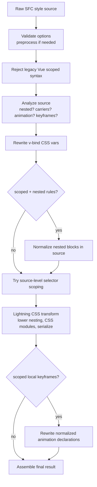

# Architecture

`@lightning-vue/compiler` is a drop-in style-compiler replacement for
`@vue/compiler-sfc`.

Its job is narrow but difficult:

- keep the public `compiler-sfc` style API
- preserve Vue scoped-style semantics
- use Lightning CSS for the expensive CSS work
- stay faster than the PostCSS-based pipeline on the common cases

The important consequence is that this package is **not** a pure Lightning CSS
visitor implementation.

It is a **source-first compiler pipeline** with three kinds of work:

1. cheap source analysis and source rewrites
2. a Lightning CSS transform
3. a narrow post-transform fixup stage

That shape is more complex than a single AST pass, but it consistently
benchmarks better for Vue SFC styles.

## What This Package Owns

This package only replaces style compilation:

- `compileStyle(...)`
- `compileStyleAsync(...)`
- `compileStyleWithLightningCss(...)`

Everything else is re-exported from `@vue/compiler-sfc`.

The main entrypoint is
[src/compileStyle.ts](./src/compileStyle.ts).

## First Principles

There are three constraints that drive the design:

1. Lightning CSS understands CSS, but it does not understand Vue-specific
   selector semantics such as `:deep(...)`, `:slotted(...)`, and `:global(...)`.
2. Vue scoped styles are not “just add `[data-v-xxx]` everywhere”.
   Nested rules, deep boundaries, slot scope, and global escapes all affect
   where the scope attribute is allowed to appear.
3. For performance, we do not want every stylesheet to pay for a full AST-based
   scoped rewrite when most styles are ordinary local selectors.

So the package is built around a simple rule:

- do the cheapest correct thing first
- only escalate to heavier work when the stylesheet actually needs it

## End-to-End Flow



The fast path is:

- no preprocessors
- no nested rules
- no scoped selector specials
- no local keyframes

That path stays almost entirely in cheap source rewrites plus one Lightning CSS
transform.

## The Stages

### 1. Validate and Preprocess

`compileStyle.ts` first validates the supported option surface. This package is
intentionally strict: unsupported PostCSS-specific features fail fast instead of
silently falling back.

If the style uses Sass, Less, or Stylus, preprocessing runs before any CSS
analysis so the rest of the pipeline always sees plain CSS.

### 2. Reject Legacy Vue Scoped Syntax

Legacy syntax such as `>>>`, `/deep/`, or `::v-deep` is rejected early in
[scoped/legacy.ts](./src/style/lightningcss/scoped/legacy.ts).

This is a deliberate maintenance choice. Supporting the old syntax would add
parsing branches to the hot path for no real benefit.

### 3. Analyze the Source

[analysis.ts](./src/style/lightningcss/analysis.ts) is a cheap routing stage.
It answers:

- does this stylesheet contain nested style rules?
- does it contain modern Vue scope carriers?
- does it contain animation declarations?
- which local `@keyframes` names will be renamed?
- does it contain `v-bind(...)`?

This stage exists so later work can stay conditional instead of unconditional.

### 4. Rewrite `v-bind(...)`

`v-bind(...)` CSS vars are still handled at the source layer. This is cheap,
stable, and easy to map back to original source locations.

### 5. Normalize Nested Blocks

If the style is both `scoped` and nested, the package normalizes nested blocks
**before** selector scoping in
[nesting/normalize.ts](./src/style/lightningcss/nesting/normalize.ts).

This is one of the most important design decisions in the package.

The normalizer does not lower nesting syntax to final flat CSS. Instead, it
rewrites the source into a shape that later selector scoping can reason about.

Example:

```css
.foo {
  color: red;
  .bar {
    color: blue;
  }
}
```

is normalized into the equivalent of:

```css
:global(.foo) {
  & {
    color: red;
  }
  .bar {
    color: blue;
  }
}
```

Why that odd shape?

- the parent `.foo` rule is acting as a **nesting boundary**
- its own declarations still need to compile to `.foo[data-v] { ... }`
- but its nested descendants should compile to `.foo .bar[data-v]`, not
  `.foo[data-v] .bar[data-v]`

So the normalizer:

- wraps top-level declarations into explicit `& { ... }` blocks
- marks context-only parent selectors as “do not inject scope here”
- propagates deep/slot context through nested conditional at-rules
- hoists declaration-only nested at-rule subtrees that cannot stay inside a
  style-rule body

This stage is intentionally source-based because it benchmarks better than the
AST-heavy alternative for carrier-heavy nested styles.

## The Scoped Selector Model

The scoped rewrite is the conceptual core of the package.

### Scope Carriers

The modern Vue carriers are defined in
[scopeCarriers.ts](./src/style/lightningcss/scopeCarriers.ts):

- `:deep(...)`
- `:slotted(...)`
- `:global(...)`

These are not rewritten directly into final selectors. Instead, the compiler
first lowers them into an internal selector form.

### Why There Is an Internal Marker IR

Vue scoping needs intermediate signals that do not exist in real CSS:

- “this branch must not receive the normal scope attribute”
- “the deep boundary is here; do not move the injection anchor past this point”

So the scoped selector pipeline uses two temporary internal marker attributes:

- `[__VUE_SCOPE_NO_INJECT__]`
- `[__VUE_SCOPE_DEEP__]`

They are never emitted in final CSS. They only exist during rewriting.

Do not confuse these with the **source-level no-inject carrier** used by
nested normalization. The normalizer rewrites a context-only selector like
`.foo` into `:global(.foo)` because `:global(...)` is already a real Vue escape
hatch meaning “keep this selector branch, but do not inject local scope onto
it”. Later, when that source is parsed for scoped rewriting, `:global(...)`
lowers into the internal `[__VUE_SCOPE_NO_INJECT__]` marker.

### The Scoped Selector Pipeline

The scoped rewrite is split into:

- [scoped/rewrite.ts](./src/style/lightningcss/scoped/rewrite.ts)
- [scoped/selector/direct.ts](./src/style/lightningcss/scoped/selector/direct.ts)
- [scoped/selector/expansion.ts](./src/style/lightningcss/scoped/selector/expansion.ts)
- [scoped/selector/placement/](./src/style/lightningcss/scoped/selector/placement)

There are two selector paths:

- **direct path**
  selectors with no Vue carriers can inject `[data-v-xxx]` immediately
- **expanded path**
  selectors with `:deep(...)`, `:slotted(...)`, `:global(...)`, or mixed
  `:is(...)` / `:where(...)` structure first become explicit internal states

The expanded path has three stages:

1. **expansion**
2. **placement**
3. **cleanup**

#### 1. Expansion

Expansion turns Vue syntax into ordinary selector states plus internal markers.

Examples:

```css
:global(.btn);
```

becomes conceptually:

```css
[__VUE_SCOPE_NO_INJECT__] .btn
```

meaning:

- keep `.btn`
- do not inject `[data-v-xxx]` onto this selector branch

```css
.panel: deep(.title);
```

becomes conceptually:

```css
.panel [__VUE_SCOPE_DEEP__] .title
```

meaning:

- scope the `.panel` side normally
- everything to the right of the deep boundary is outside normal local scoping

`:slotted(...)` is the one eager special case:

- its inner selector is immediately given the slot scope attribute
- then a no-inject marker is prepended so the later placement phase does not
  inject a second scope attribute on top of it

Expansion produces an explicit `ExpandedScopedSelector` state:

- `selector`
- `deep`
- `placementKind`
- `needsNestedScopeRewrite`

That state is the handoff between expansion and placement.

It exists for a simple reason: placement should not have to rediscover the same
facts from raw selector syntax on every pass.

#### 2. Placement

Once a selector is in the expanded form, the compiler can decide where to
insert the real scope attribute:

- normal scope: `[data-v-xxx]`
- slot scope: `[data-v-xxx-s]`
- no injection

The key idea is the **injection anchor**:

- find the rightmost selector component that should still belong to the local
  branch
- insert the scope attribute immediately after it
- stop searching once a deep marker has been crossed

Example:

```css
.panel [__VUE_SCOPE_DEEP__] .title
```

gets its anchor frozen at `.panel`, so the final effect is:

```css
.panel[data-v-xxx] .title
```

not:

```css
.panel .title[data-v-xxx]
```

and not:

```css
.panel[data-v-xxx] .title[data-v-xxx]
```

Placement itself is split further:

- [placement/structure.ts](./src/style/lightningcss/scoped/selector/placement/structure.ts)
  decides whether selector structure must split before anchor selection
- [placement/compound.ts](./src/style/lightningcss/scoped/selector/placement/compound.ts)
  owns compound-level anchor checks and idempotent “already scoped?” logic
- [placement/nested.ts](./src/style/lightningcss/scoped/selector/placement/nested.ts)
  rewrites nested `:is(...)` / `:where(...)` branches after outer placement
- [placement/index.ts](./src/style/lightningcss/scoped/selector/placement/index.ts)
  coordinates placement itself

The two ideas to keep in mind are:

- `placementKind` answers:
  does this selector structure need to split before we choose an anchor?
- nested scope context answers:
  are we still on the local side, or already after `:deep(...)`, inside
  `:slotted(...)`, or fully unscoped?

Those are different questions, and separating them is what keeps the placement
code understandable.

#### 3. Cleanup

After the real scope attributes have been placed, the temporary markers are
removed recursively, including inside selector containers such as `:is(...)`,
`:where(...)`, `:has(...)`, and `:not(...)`.

At that point the selector is ordinary CSS again.

## Source-Level Scoping vs Visitor Scoping

The package prefers source-level scoping in
[scoped/source.ts](./src/style/lightningcss/scoped/source.ts).

That path is used when:

- the style is `scoped`
- CSS Modules are not enabled
- the source rewrite succeeds

It has two subpaths:

- **direct prelude rewrite**
  when analysis says there are no Vue carriers, `scopeSelectorPrelude(...)` from
  `@lightning-vue/utils` can inject `[data-v-xxx]` very cheaply
- **parsed source rewrite**
  when carriers are present, selectors are parsed and the full scoped rewrite
  pipeline runs

If source scoping cannot handle the stylesheet, the compiler falls back to
visitor-based selector rewriting inside Lightning CSS.

That fallback exists for correctness, but the source path is the performance
target.

## What Lightning CSS Is Responsible For

After source rewrites, Lightning CSS is used for the parts it is good at:

- parsing CSS
- lowering nesting
- serializing normalized CSS
- CSS Modules compilation
- any remaining selector visitor work when source scoping did not finish it

The style visitor is intentionally small. See
[visitor.ts](./src/style/lightningcss/visitor.ts).

The package does **not** try to encode all Vue semantics inside the Lightning
CSS visitor. That approach was simpler conceptually, but slower in practice.

## Why Animation Uses a Different Strategy

Animation/keyframe handling is the main case where the package leans more on
Lightning CSS instead of less.

For scoped local keyframes:

- the source analysis records the keyframe rename map
- Lightning CSS does the normal declaration parsing and serialization
- the package then performs a narrow post-transform rewrite in
  [scoped/animation/](./src/style/lightningcss/scoped/animation)

This works well because animation declarations benefit from Lightning CSS’s
normalization. Unlike nested selector semantics, preserving raw authored source
shape here was not worth the complexity.

## Why This Package Is Not Simpler

If simplicity were the only goal, we would likely choose one of these designs:

- everything in a Lightning CSS AST visitor
- everything as source-to-source rewriting

The package does neither.

It intentionally uses a hybrid:

- source-based routing and rewriting on the hot path
- Lightning CSS for parsing, lowering, serialization, and CSS Modules
- a tiny post-transform fixup where that is cheaper than preserving source
  trivia

That means more moving parts, but it preserves the performance properties we
care about:

- cheap common-case scoped styles
- fast nested carrier-heavy styles
- fewer expensive visitor passes
- predictable sourcemap behavior across preprocessors and rewrites

## Module Guide

### `src/compileStyle.ts`

Top-level orchestration:

- validate
- preprocess
- analyze
- rewrite source as needed
- run Lightning CSS
- finalize result

### `src/style/lightningcss/analysis.ts`

Cheap source feature detection and keyframe rename collection.

### `src/style/lightningcss/scopeCarriers.ts`

The syntax contract for modern Vue scope carriers.

### `src/style/lightningcss/nesting/`

Source-based nested normalization and nested-context analysis.

### `src/style/lightningcss/scoped/`

Vue-specific scoped-style policy.

Important submodules:

- `rewrite.ts`
  selector-pipeline entrypoint
- `selector/direct.ts`
  cheap no-carrier path
- `selector/expansion.ts`
  carrier expansion into explicit selector states
- `selector/placement/`
  structure normalization, compound checks, nested rewriting, and cleanup
- `source.ts`
  parsed source-level scoping
- `legacy.ts`
  early legacy-syntax rejection

### `src/style/lightningcss/scoped/animation/`

Post-transform scoped keyframe and animation declaration rewrite.

### `src/style/preprocessors.ts`

Sass / Less / Stylus integration kept for `compiler-sfc` compatibility.

## Boundary With `@lightning-vue/utils`

`@lightning-vue/utils` owns generic mechanics:

- selector parsing/stringifying
- source-level selector rewriting
- block tree walking
- source text range helpers

This package owns Vue policy:

- what `:deep(...)`, `:slotted(...)`, and `:global(...)` mean
- where scope may be injected
- how nested context propagates
- when a selector branch becomes context-only
- which compatibility choices are accepted or rejected

That boundary is deliberate. Moving Vue policy down into the utility package
would make the shared layer harder to reason about and harder to reuse.
