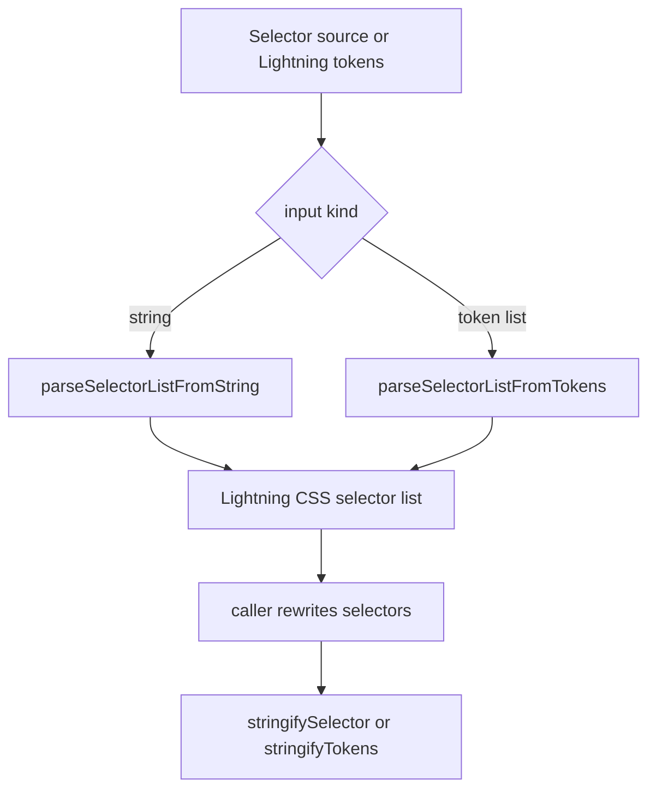
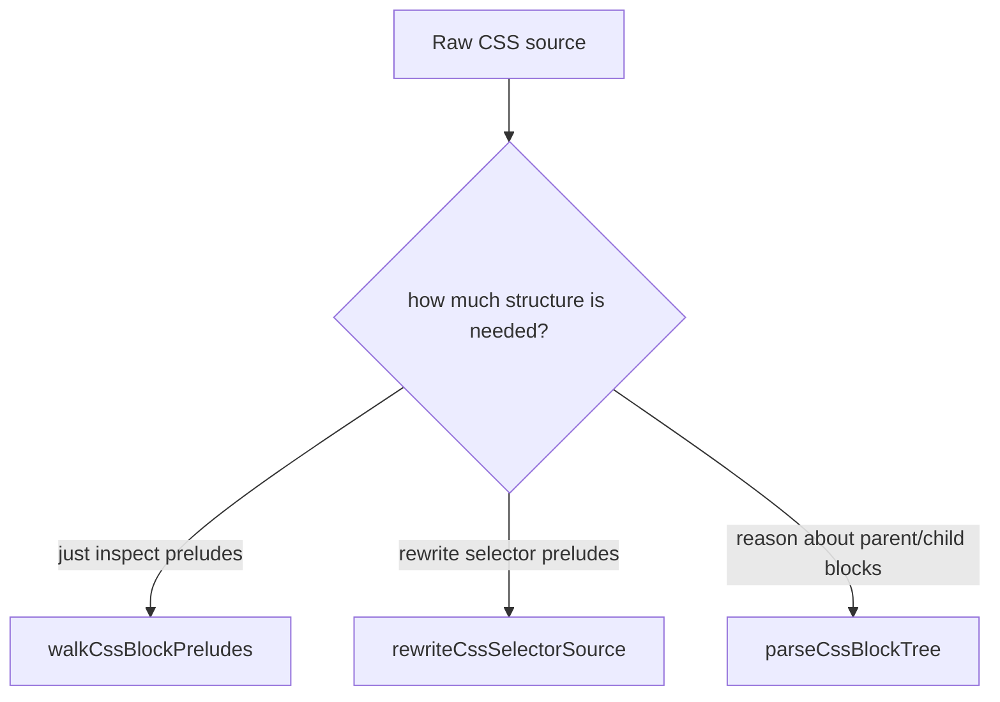

# Architecture

`@lightning-vue/utils` is the shared low-level toolkit used by
`@lightning-vue/compiler`.

It exists for one reason:

- higher layers need to inspect and rewrite CSS source and selectors
- Lightning CSS already has useful selector data structures
- a full extra CSS/selector AST would add cost, copies, and another abstraction
  layer

So this package is intentionally a **small bridge** between:

- raw CSS source text
- Lightning CSS-compatible selector data

It is optimized for:

- low allocation
- progressive cost
- composable building blocks

It is **not** optimized for:

- a broad PostCSS-style editing API
- a mutable selector/container object model
- framework-specific policy

## First Principles

There are two different kinds of work that callers need:

1. **selector work**
   parse selector lists, inspect them, rewrite them, stringify them
2. **source work**
   walk CSS blocks, rewrite only selector preludes, reason about nested block
   ranges

Those two kinds of work are related, but they are not the same.

That is why the package is split into two internal surfaces:

- `selectors/`
- `source/`

The package root simply re-exports the pieces that higher layers actually use.

## Core Design Choice: No Package-Local Selector AST

The most important decision in this package is that it does **not** define its
own selector AST.

It uses Lightning CSS selector shapes directly.

Why:

- no translation layer between “utility AST” and Lightning CSS AST
- token-based Lightning CSS inputs can be parsed into the same representation
- higher layers can rewrite selectors and hand them back to Lightning CSS
  without another conversion pass

Tradeoff:

- the API is intentionally coupled to Lightning CSS selector types
- this package is narrower than a general selector library

That tradeoff is deliberate. This package is supposed to be a fast bridge, not
an abstraction boundary for its own sake.

## Two Workflows

This package does not own one big compiler pipeline. It provides two families of
primitives.

### Selector Workflow

### Source Workflow

This “progressive cost” model is the main architectural idea of the package:

- do not parse more than the caller actually needs

## Public Surface

The root entrypoint exports a flat, practical surface:

- selector parsing and stringifying
- source prelude walking
- source prelude rewriting
- block tree parsing
- small source-range helpers

That flat export surface is for convenience.

Internally, the real structure is still:

- `selectors/`
- `source/`

## `selectors/`: Parse and Stringify Lightning-Compatible Selectors

The selector side owns:

- parsing selector lists from strings
- parsing selector lists from Lightning CSS token arrays
- stringifying selector lists and tokens
- a small amount of compatibility parsing for safe fast paths

Important files:

- [src/selectors/index.ts](./src/selectors/index.ts)
- [src/selectors/parserBase.ts](./src/selectors/parserBase.ts)
- [src/selectors/stringParser.ts](./src/selectors/stringParser.ts)
- [src/selectors/tokenParser.ts](./src/selectors/tokenParser.ts)
- [src/selectors/stringify.ts](./src/selectors/stringify.ts)

### The Parser Shape

The selector parser has:

- one shared grammar core
- two thin front ends

The shared grammar lives in
[parserBase.ts](./src/selectors/parserBase.ts).

The front ends are:

- [stringParser.ts](./src/selectors/stringParser.ts)
- [tokenParser.ts](./src/selectors/tokenParser.ts)

That structure matters because the old alternative was effectively “the same
parser twice”.

The current architecture keeps:

- one place for selector grammar decisions
- one place for container pseudo handling
- one place for standard pseudo-function handling

while still allowing string-specific and token-specific reading logic to stay
specialized.

### Why The Selector Parser Is Narrow

The parser is intentionally built for what this monorepo actually needs:

- selector lists
- selector-list pseudo arguments
- the standard pseudo functions that matter to selector transforms
- enough raw-source fidelity for safe round-trips

It intentionally does **not** try to be:

- a clone of `postcss-selector-parser`
- a universal CSS fragment parser
- a framework extension registry

This keeps the grammar and the hot path smaller.

### Compatibility and Fallback

There are two important compatibility choices:

1. `parseSelectorListFromString(...)` can take a cheap compatibility shortcut
   through [compat.ts](./src/selectors/compat.ts) for simple fragments.
2. `parseSelectorListFromTokens(...)` falls back by stringifying tokens and
   reparsing them if the direct token parser rejects the input.

Those are deliberately pragmatic. They trade purity for robustness without
making the whole parser architecture more expensive.

## `source/`: Work With Raw CSS Without Building a Full CSS AST

The source side owns:

- walking block preludes
- building a lightweight block tree
- rewriting only selector preludes
- a direct scope-prelude fast path
- source text range helpers

Important files:

- [src/source/preludes.ts](./src/source/preludes.ts)
- [src/source/blockTree.ts](./src/source/blockTree.ts)
- [src/source/rewrite.ts](./src/source/rewrite.ts)
- [src/source/scopePrelude.ts](./src/source/scopePrelude.ts)
- [src/source/segments.ts](./src/source/segments.ts)
- [src/source/shared.ts](./src/source/shared.ts)

### The Progressive-Cost Model

The source APIs are intentionally layered by cost:

#### 1. `walkCssBlockPreludes(...)`

Use this when the caller only needs to know:

- where block preludes are
- whether a block is a style rule, at-rule, or keyframes rule
- what the normalized prelude looks like

This is the lightest structural pass.

#### 2. `rewriteCssSelectorSource(...)`

Use this when the caller wants to rewrite selector preludes in-place while
leaving the rest of the stylesheet alone.

This is the main source-to-source transform primitive.

It walks block preludes, skips non-selector contexts, and rewrites only the
prelude slice for each style rule.

#### 3. `parseCssBlockTree(...)`

Use this when the caller needs actual parent/child block relationships.

This is intentionally still structural, not semantic. The result is a lightweight
block tree, not a full stylesheet AST.

This ordering is deliberate: many transforms only need a prelude walk or a
selector rewrite and should not pay for block-tree construction.

## The Selector Prelude Rewrite Model

[source/rewrite.ts](./src/source/rewrite.ts) is one of the most important
modules in the package.

It is built around a collector-style API:

- optional direct prelude fast path
- parsed fallback when needed
- selector rewrites appended into a caller-owned target array

That API is shaped like this on purpose:

- one input selector may expand into many output selectors
- the hot path should not allocate wrapper arrays unnecessarily
- callers should be able to plug in their own selector rewrite logic

So instead of returning `Selector[]` for every selector, the package lets the
caller append into a target array directly.

That is slightly less elegant than a “pure” functional API, but it is cheaper
on hot paths.

## Why `scopePrelude.ts` Exists

[source/scopePrelude.ts](./src/source/scopePrelude.ts) is intentionally a
special case.

It injects a fixed scope attribute into a selector-list prelude **without**
building a selector AST.

That means:

- common selector lists can be rewritten very cheaply
- callers can stay off the parser path when the input is simple
- the package can offer a direct fast path for scope injection while still
  falling back to full selector parsing when the selector gets complicated

This is one of the clearest examples of the package choosing performance over
conceptual minimalism.

The more “pure” alternative would be:

- always parse selectors first

But that would make simple scope injection pay for parser work it does not need.

## Why The Source APIs Are Not One Big Parser

It might be tempting to merge:

- prelude walking
- block-tree parsing
- source rewriting

into one unified CSS source parser API.

This package intentionally does not do that.

Why:

- different callers need different amounts of structure
- one large abstraction would force many callers onto the expensive path
- the compiler package relies on being able to choose the cheapest primitive
  that matches the transform

So the package keeps several source primitives instead of one “complete” one.

## What Lives Here vs What Does Not

This package is where **generic mechanics** belong:

- selector parsing/stringifying
- token-to-selector bridging
- block prelude walking
- block tree construction
- source-range scanning
- generic selector-source rewriting

This package is **not** where framework policy belongs.

For example, it should not decide:

- what `:deep(...)` means
- how Vue slot scoping works
- where a component scope attribute should be injected
- how nested scoped rules change context

Those are compiler-level semantics and belong in
`@lightning-vue/compiler`.

That boundary is deliberate. It keeps this package reusable and keeps its API
from turning into a framework-specific grab bag.

## Perf-First Choices

Several design decisions here are explicitly optimized for performance rather
than simplicity.

### 1. No extra selector AST

The package uses Lightning CSS selector shapes directly instead of creating a
package-local AST and converting in and out of it.

### 2. Shared grammar core, thin readers

The parser architecture is unified where correctness matters, but it avoids a
more abstract and allocation-heavy “generic token stream” object model.

### 3. Progressive-cost source primitives

Callers can choose between:

- prelude walk
- selector rewrite
- block tree

instead of being forced through the most expensive structure every time.

### 4. Collector-based rewrite callbacks

The source rewrite API is optimized for one-to-many selector expansion without
per-selector wrapper allocations.

### 5. Specialized direct fast paths

`scopePrelude.ts` exists because some common rewrites are worth special-casing
instead of always using the general parser.

## Guidance For Future Changes

Prefer:

- keeping this package generic
- adding helpers only when they are reusable outside one compiler detail
- preserving the progressive-cost model
- checking parser and source changes against benchmarks

Avoid:

- framework-specific semantics
- broad convenience layers that allocate heavily
- growing the selector surface toward a PostCSS clone
- collapsing all source primitives into one heavier abstraction

In short:

this package should remain a **small, fast bridge** between raw CSS source and
Lightning CSS-compatible selector data, even when that means the API is narrower
and the internals are more specialized than a general-purpose library would be.
